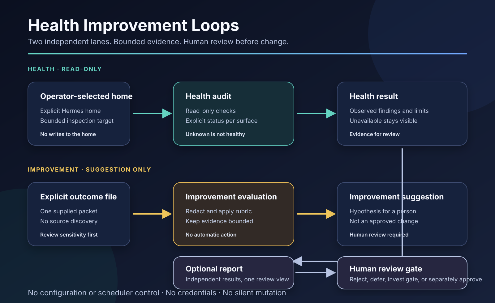

# Hermes Health Improvement Loops

A companion operating playbook for using [Hermes Health Improvement Loops](https://github.com/AtlasOmnia/hermes-health-improvement-loops) safely. The playbook keeps bounded health auditing separate from suggestion-only improvement evaluation and points operators to the executable project for current behavior.



## What it includes

- `SKILL.md` — the companion operating playbook for Hermes agents and operators.
- `../../assets/hermes-health-improvement-loops.svg` — an accessible workflow illustration shared by the pack.

The executable implementation, current release information, and full check inventory are maintained in the [public project](https://github.com/AtlasOmnia/hermes-health-improvement-loops). For the authoritative categories, limits, inputs, and status semantics, read the [health-check matrix](https://github.com/AtlasOmnia/hermes-health-improvement-loops/blob/main/docs/health-check-matrix.md).

## Install

Inspect the skill first:

```bash
hermes skills inspect https://raw.githubusercontent.com/AtlasOmnia/hermes-custom-pack/main/skills/hermes-health-improvement-loops/SKILL.md
```

Install it directly from the current public pack:

```bash
hermes skills install https://raw.githubusercontent.com/AtlasOmnia/hermes-custom-pack/main/skills/hermes-health-improvement-loops/SKILL.md
```

Start a new Hermes session after installation so the skill registry is refreshed. Clone the pack when you want to browse the shared asset and collection sources together:

```bash
git clone https://github.com/AtlasOmnia/hermes-custom-pack.git
cd hermes-custom-pack/skills/hermes-health-improvement-loops
```

## One-time setup

1. Read the playbook and the public project README.
2. Review the current [health-check matrix](https://github.com/AtlasOmnia/hermes-health-improvement-loops/blob/main/docs/health-check-matrix.md) before relying on a category, limit, or status meaning.
3. Decide which lane is needed: a bounded health audit, an evaluation of one explicitly supplied outcome file, or an optional report over already-produced results.
4. Select the Hermes home explicitly for health work and select the outcome file explicitly for improvement work.
5. Choose an external runtime location for package-owned reports or ledgers when the implementation requires one. Keep it separate from the Hermes home and source checkout.
6. Use a dry-run or manifest-rendering mode first when the public implementation offers one. Treat its output as review material, not as proof that anything was installed or changed.
7. Before any separately authorized Hermes mutation, load `hermes-agent` and check the installed CLI help for the exact command syntax. This playbook does not authorize mutation.

## Design notes

Health and improvement are independent by design:

- Health performs bounded, read-only observation against an operator-selected home.
- Improvement evaluates only an explicitly supplied outcome packet or fixture and produces a suggestion for human review.
- An optional report may place the two results side by side without merging inputs, permissions, or authority.
- Unknown, unavailable, malformed, unsupported, stale, or errored evidence is never silently presented as healthy.
- The playbook does not choose models, providers, routes, hosts, transports, schedules, delivery targets, accounts, or profiles.
- The playbook does not change Hermes configuration, scheduler state, skills, memory, sessions, credentials, or external delivery systems.

See the public implementation for the executable behavior; do not copy its source into the skill package. The companion remains intentionally stable while the implementation and matrix evolve independently.

## License

This companion package is released under the [MIT License](../../LICENSE). The public implementation is also MIT-licensed; consult its repository for its complete license and attribution details.
